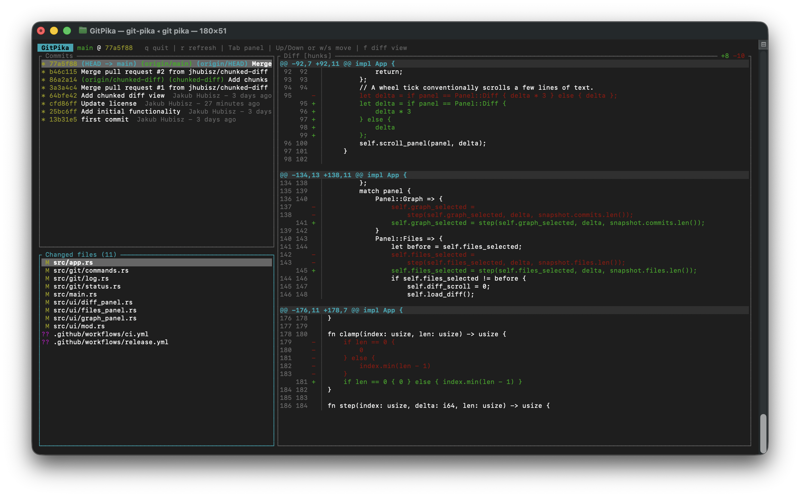

# GitPika

A fast, local-first Rust TUI Git workbench focused on branch visualization, changed files, and instant diffs.

This first version is **read-only**: it never stages, commits, checks out, or otherwise modifies your repository.

## Layout



## Build and run

```bash
cargo build --release
```

Run it from inside any Git repository:

```bash
cargo run
```

Or install it so Git can dispatch to it as a subcommand:

```bash
cargo install --path .
git pika
```

## Keys

| Key | Action |
|-----|--------|
| `q` / `Esc` | Quit |
| `r` | Refresh repository state |
| `Tab` / `Ctrl+Tab` or `Shift+Tab` | Cycle active panel forward / backward |
| `↑` / `↓` or `w` / `s` | Move selection in the active panel / scroll the diff |
| `Shift+↑` / `Shift+↓` or `W` / `S` | Always scroll the diff, regardless of active panel |
| `f` | Toggle diff view: hunks only / full file with inline changes |
| Mouse wheel | Scroll the panel under the cursor |

Selecting a file in the changed files panel instantly shows its diff. Untracked files are shown as an "all lines added" preview.

## Development

```bash
cargo test     # parser unit tests (git status / git log output)
cargo clippy
```

Git access is isolated in `src/git/commands.rs`; all data is read via the Git CLI (`git status --porcelain=v1`, `git log`, `git diff`).
